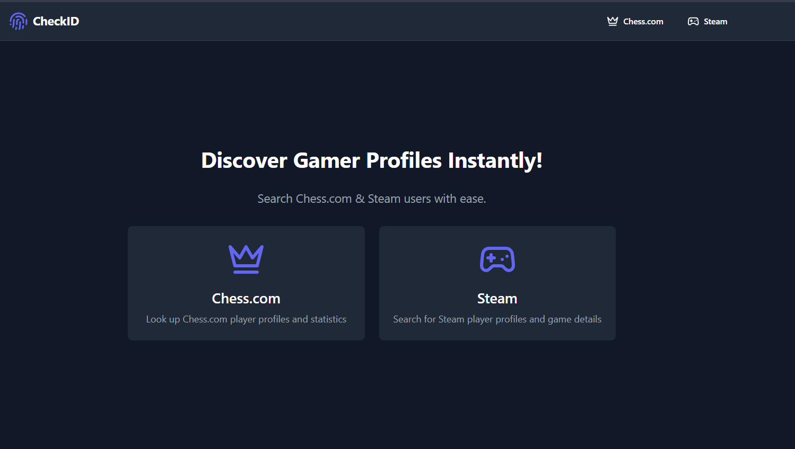
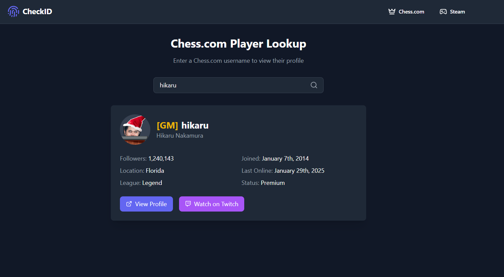
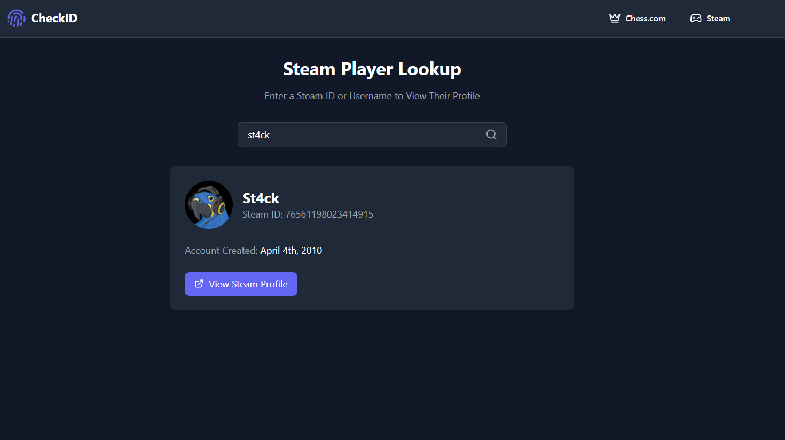

# CheckID - Chess & Steam Profile Lookup

CheckID is a web tool that lets you search and view user profiles from **Chess.com** and **Steam**. By entering a username, you can access profile details such as avatars, usernames, account creation date, and more. The tool provides a clean, dynamic interface that updates results in real-time. 💻✨

## 🚀 Features
- **♟️ Chess.com Profile Lookup**: Search for Chess.com user profiles by username and view profile details.
- **🎮 Steam Profile Lookup**: Search for Steam user profiles by username and display information like ID, avatar, and more.
- **🔄 Dynamic Search**: The tool updates search results in real-time based on entered usernames.
- **📱💻 Modern, Responsive UI**: Built with Tailwind CSS for a clean, professional, and responsive design.

## 🛠️ Technologies Used
- **⚛️ React**: For building the user interface.
- **📝 TypeScript**: For better code quality and type safety.
- **🎨 Tailwind CSS**: For styling the application with utility-first CSS.
- **⚡ Vite**: For fast and efficient development and build processes.
- **🐳 Docker**: For containerizing the application to make deployment easy.

## 🔧 Prerequisites

Before using CheckID, ensure you have the following installed:

- **💡 Node.js** (v14 or higher)
- **💻 npm** (v6 or higher)
- **🐋 docker** (Docker must be installed on your system. You can download it from [Docker's official site.](https://www.docker.com/get-started/))

## 🚀 Get Started

You can run the CheckID app either by **cloning the repository using Git** or by using **Docker**. Below are the steps for both methods:

### 🧑‍💻 Git Usage

1. **Clone the Repository**:
   
   First, clone the CheckID repository to your local machine using Git:

   ```bash
   git clone https://github.com/iqlip/CheckID.git
   ```
2. **Navigate to the Project Directory**:
   
    After cloning, go into the project directory:
   
   ```bash
   cd CheckID
   ```

3. **Install Dependencies**:
   
     Run the following command to install the necessary dependencies:

    ```bash
    npm install
    ```

4. **Run the Development Server**:

     Once the dependencies are installed, you can start the development server using Vite:

   ```bash
   npm run dev
   ```

   The app will be available at http://localhost:5173


### 🐳 Docker Usage

1. **Pulling the Image**
   
   To pull the latest image from Docker Hub:

    ```bash
    docker pull iqlip/checkid:latest
    ```

2. **Running the Docker Container**

   Once the image is pulled, you can run the container using:

   ```bash
   docker run -d -p 80:80 iqlip/checkid:latest
   ```
   This command will run the container in detached mode (-d) and expose port 80 for accessing the app in your browser.

3. **Accessing the Application**

   Once the container is running, access the CheckID web application by navigating to http://localhost in your web browser
   

## Screenshots 📸



**Chess.com Profile Lookup**



**Steam Profile Lookup**



## 🌐 Socials 

- GitHub: https://github.com/iqlipx
- Portfolio: https://iqlip.vercel.app 

